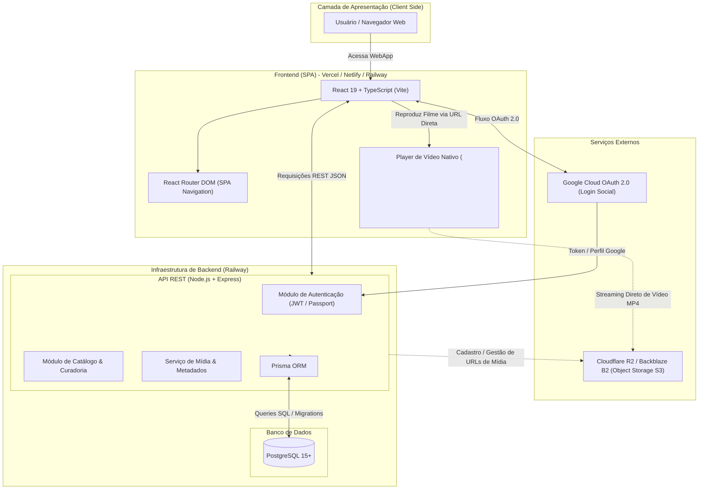
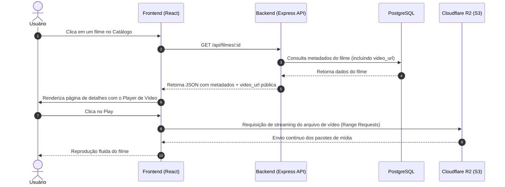

# Arquitetura Inicial do Sistema — Rolliude Play

Este documento detalha o desenho da arquitetura técnica da plataforma **Rolliude Play** para o MVP (Sprint 0 a Sprint 3), destacando os fluxos de dados, componentes de front-end, back-end, banco de dados e a estratégia de streaming/armazenamento de mídia.

---

## 1. Visão Geral da Arquitetura (Diagrama)

---

## 2. Descrição dos Componentes e Camadas

### 2.1. Front-end (Cliente)
- **Tecnologia:** React 19, TypeScript, Vite.
- **Roteamento:** `react-router-dom` gerenciando as páginas (Home, Catálogo, Detalhes do Filme, Login, Cadastro).
- **Player de Vídeo:** Tag nativa `<video>` do HTML5.
  - **Decisão Arquitetural:** Como as obras do MVP são de **domínio público**, o streaming é feito via requisição direta (`GET`) para a URL pública do arquivo MP4 no Object Storage, sem overhead de DRM ou chaves criptográficas neste momento.

### 2.2. Back-end (API REST)
- **Tecnologia:** Node.js + Express com TypeScript.
- **Hospedagem:** Railway (container Docker Node.js).
- **Módulos Principais:**
  - **Auth:** Gerenciamento de sessões com JWT e integração com Google OAuth 2.0.
  - **Catálogo & Filmes:** Endpoints de listagem de filmes, filtros por gênero, detalhes de obras e informações regionais.
  - **Mídia:** Armazenamento das URLs públicas dos vídeos e metadados no banco.

### 2.3. Banco de Dados
- **Tecnologia:** PostgreSQL hospedado e gerenciado via Railway.
- **Camada de Acesso (ORM):** Prisma ORM (facilita migrations automatizadas, tipagem estática ponta a ponta e integridade referencial).

### 2.4. Armazenamento de Mídia (Object Storage)
- **Serviço:** Cloudflare R2 ou Backblaze B2 (compatível com API S3 da AWS).
- **Motivo de Escolha:** Custo zero de tráfego de saída (*egress free* no R2) ou muito baixo, ideal para servir arquivos pesados de filmes sem onerar o servidor principal da API no Railway.

---

## 3. Fluxo de Execução Central (Assistir Filme)

